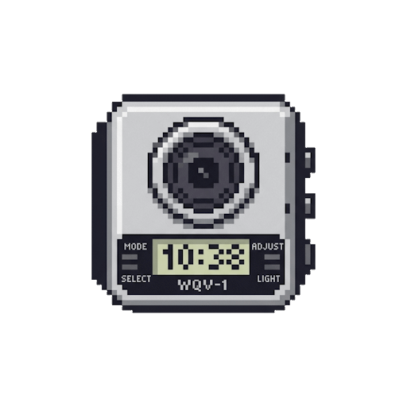

<div align="center">
  
  <h1>Casio WQV-1 Emulator</h1>
  <p><strong>A retro web-based emulator for the classic Casio WQV-1 Wrist Camera.</strong></p>

  [](https://metanef.github.io/casio-wqv-1/)
  [](https://metanef.github.io/casio-wqv-1/)
</div>

<br/>

## 🌟 About the Project

Experience the nostalgia of the very first watch with a built-in digital camera! This web application faithfully recreates the iconic 120x120 pixelated, grayscale aesthetic of the early 2000s. Whether you're on your computer or your smartphone, you can step back in time and capture the world in pure retro style.

---

## ✨ Features

- **Live Camera Feed**: Access your webcam/phone camera with a real-time retro dithered filter.
- **Image Import**: Upload any image from your device to see it transformed through the WQV-1 lens.
- **Take Photos**: Snap pictures that automatically save to your interactive bottom gallery.
- **Modal View**: Click on any photo in the gallery to view it enlarged with perfect pixel-art scaling.
- **Download**: Save your 120x120 retro masterpieces directly to your device.
- **PWA Support**: Install the app on your Android or iOS device to use it fullscreen and offline, just like a native app!
- **Adjustments**:
  - **BRIGHT**: Cycle through different brightness levels.
  - **COLOR**: Cycle through different retro color palettes (Grayscale, GameBoy, Sepia, VirtualBoy, Inverted).

---

## 🛠️ Technologies Used

This project is built using a lightweight, modern web stack without heavy frameworks:

- **HTML5 & CSS3**: Core layout and structure.
- **Vanilla JavaScript (ES6+)**: Handles camera streams, canvas manipulation, and UI interactions.
- **Tailwind CSS**: Used for rapid UI styling, custom watch casing, and responsive design.
- **Canvas API**: Powers the custom image processing, specifically the **Ordered Dithering via a Bayer Matrix** to achieve the authentic Casio look.
- **Service Workers (PWA)**: Ensures offline capabilities and allows native installation on mobile devices.

---

## 📝 TODO List

Want to contribute or see what's coming next? Here's the roadmap:

- [x] Add authentic retro sound effects (shutter click, button beeps).
- [x] Save the gallery photos to `localStorage` so they persist after refreshing the app.
- [x] Add different retro color palettes (e.g., GameBoy green, sepia).
- [x] Implement a self-timer feature.
- [ ] Add a button toreturn camera for phones
- [ ] Improve the UI responsiveness for very small or very large screens.

---

## 🚀 How to Run Locally

If you want to run or modify the project on your own machine:

1. Clone the repository:
   ```bash
   git clone https://github.com/metanef/casio-wqv-1.git
   ```
2. Open the project folder.
3. Since the application uses the Camera API (`getUserMedia`), it needs to be run in a secure context (HTTPS or localhost).
   - **Using Node.js**: Run `npx serve .` in the terminal.
   - **Using VS Code**: Install the "Live Server" extension, right-click `index.html`, and select "Open with Live Server".
